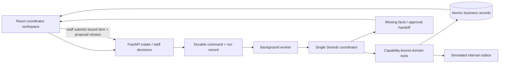
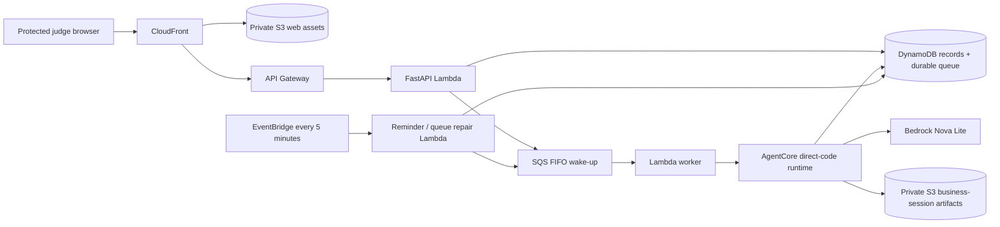

# Architecture

Both adapters execute the same deterministic domain rules. Model-generated text is never the authority for staff approval, item availability, capacity or inspection.

Local: SQLite WAL + local worker thread + scenario clock. Simulator uses an explicit parser and the same domain rules; live mode invokes Strands/Nova Lite in a bounded child process. Agent runs are limited to 60 seconds and 12 tool calls; model responses are capped at 2,048 output tokens per model call.

Tools: `read_request`, `search_inventory`, `propose_request`, `reserve_approved_equipment`, `assign_driver`, `record_lifecycle_event`, `advance_clock_and_remind`, `write_outbox`. Tools bind to the authenticated persisted command. There is no arbitrary database-write tool. A tool failure rolls back its trial state; incomplete agent workflows do not commit.

Human handoff is a persisted application state, resumed by a new queued staff command. This implementation **does not use Strands interrupt/resume APIs or persist its private conversation**. It preserves business continuity independently of model sessions. This is an explicit simplification from the original plan.

## Conditional AWS path — implemented, not deployed

Deployment ownership is split without changing the request flow: the disabled owner network template holds CloudFront, the HTTP API/default stage and web bucket. The app template holds the exact-API route/integration, Lambda permission and compute/data resources. Verified network outputs must be passed to the app and its IAM policy after separate owner approval. This avoids giving the app deployer account-wide CloudFront management; both stacks need explicit shutdown review.

DynamoDB stores bounded whole-sandbox documents with conditional version writes. Queue/intake/idempotency are atomic. SQS is a wake-up mechanism, not the sole copy of a command. The scheduled sweep repairs failed publishing, checks scenario-clock reminders and re-wakes pending work.

A worker lease limits duplicate execution, while conditional writes fence stale model results and sandbox resets. API writes do not hold a lock during inference. A conflicting commit may repeat model computation, bounded by three automatic attempts and a deployment-wide model-run allowance that reset does not replenish. There is no transactional rollback of a billable Bedrock call; billing uncertainty is recorded and no simulator fallback occurs.

This is a protected, small hackathon demo. Whole-document storage, paginated table scans and SQLite's serialized writes are deliberate scale limits, not production architecture claims. See `deployment.md` for limits and remaining AWS verification.
